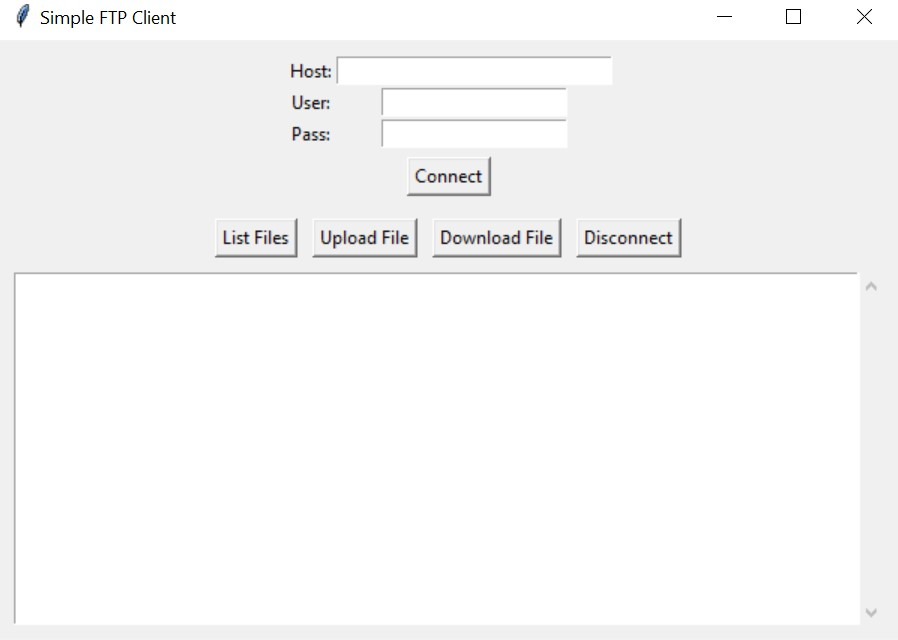

# Simple FTP Client

A lightweight GUI application for FTP file operations using tkinter.



## Features

- Connect to FTP servers with username/password authentication
- List remote directory contents
- Upload files to remote servers
- Download files from remote servers
- Simple and intuitive GUI interface

## Requirements

- Python 3.6 or higher
- Standard library modules (no external dependencies)

## Installation

No installation required beyond having Python installed.

```bash
# Clone the repository
git clone https://github.com/VincentNeemie/simple_ftp_ui.git
cd simple_ftp_ui
```

## Usage

Run the script with Python:

```bash
python main.py
```

## How to Use

1. Enter the FTP server address, username, and password
2. Click "Connect" to establish a connection
3. Use the buttons to list, upload, or download files
4. Click "Disconnect" when finished

## License

This project is licensed under the MIT License - see the [LICENSE](LICENSE) file for details.

## Contributing

Contributions are welcome! Please feel free to submit a Pull Request.

1. Fork the repository
2. Create your feature branch (`git checkout -b feature/amazing-feature`)
3. Commit your changes (`git commit -m 'Add some amazing feature'`)
4. Push to the branch (`git push origin feature/amazing-feature`)
5. Open a Pull Request